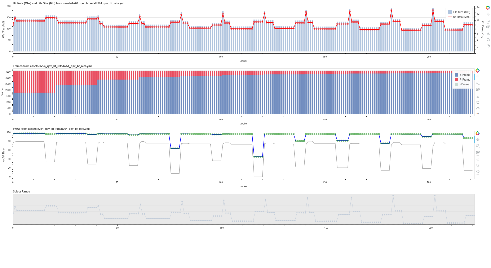

# Bast parameter hunting

h264_qsv, hevc_qsv, av1_qsv のエンコードパラメータで容量が小さく、 VMAF が優れているパラメータを模索する方法。

## Environment

## 画質探索の極意

私の知識で、簡単に動画ファイルの圧縮について記述します。  
[FFmpeg](https://www.ffmpeg.org) を利用します、 Windows などでは [HandBrake](https://handbrake.fr) など GUI で優れたエンコードソフトウェアがありますが、私の環境では Linux を主に利用しており、 Linux/Windows で同じ設定を利用出来ないと品質を維持して利用することが出来ません。  

「動画の圧縮」と一言で言っても方法が多く、広義の方法として言われる事が多いため実現したい事を定義する。世の中には地上波放送を録画して楽しむ文化がある。総称として DTV が用いられるため以下はそうする。 DTV は地上波放送を録画する関係で MPEG-2 のコーディックで配信されてくる音声、映像データを保存するため 7GB/時間となる。  
そのため、アニメやドラマを全録するような利用をすると 2600番組/年程度録画することになり単純な容量では 18TB 程度必要になる。これでは毎年高額な HDD を足す運用になり維持管理が難しいため映像を圧縮して容量を削減するのが目的である。

映像を圧縮するには codec を指定する、今回は Intel QSV を利用するため h264, hevc, av1 に対応しており圧縮率は h264 -> hevc -> av1 の順番でよくなり秒間あたりの bitrate が削減できるため動画全体として容量を圧縮できる。一方、圧縮時間は圧縮率が高い codec になるほど時間がかかるため av1 が最も優れているが、処理時間とトレードオフになる事もある。

エンコードすると多少なりとも映像は劣化する。がそれを定量的に確認する術がなく、「なんか画質悪くなった」というようなケースがあったんではなかろうか。そのため今回は結構なパターンを検証することもあり [VMAF](https://github.com/Netflix/vmaf/tree/master) を利用したスコアを確認する。 VMAF のスコアは 1080p をベースに算出され、 0-100 での数値で表記される。 全フレームの平均が採用されるが、最低値を確認する方法として `min` も存在するがこれは フレームに対して記録された最低値のため容易に 0 が記録される事がある。オプションを設定することで 調和平均(`harmonic_mean`) を確認することができる。のでこちらを利用する。

テストの目標は平均 VMAF 96 以上、容量はできるだけ小さくを目標にする。  
アニメ 1話 200MB 以下、1クオーター 500GB 前後になるようにしたい。  

FFmpeg を利用して圧縮する場合は GOP, B-Frame, 参照 B-Frame あたりのオプションが効いてくる。調べた限りでは h264_qsv の設定は `-g 256 -bf 2 -refs 3` である。 GOP は必要十分であるので変更せず、 `-bf`, `-refs` の設定を詰める事になるだろう。

画質、 VMAF については Intel QSV を利用するなら LA-ICQ (Look-Ahead Intelligent Constant Quality) を前提に考えると良いだろう。 FFmpeg で利用する場合は `-global_quality <int>` `-look_ahead 1` を設定すると LA-ICQ でエンコードされる。  

Intel QSV のエンコードの特性として、 `libx264` でよく利用される CRF(Constant Rate Factor) と同等にしたければ `-global_quality 25` とすればよい。それだけでは各 Frame の下限値を設定出来ないため、`-min_qp_i`, `-min_qp_p`, `-min_qp_b` を設定し画質の低下を調整すると画質を向上させつつ容量の削減ができる

* q(Constant Quantizer): エンコード時に出る `q=XX.X` の数値で `-global_quality` に合わせて前後する。
  * `libx264` の `-crf 23` は `q=29.0` となる
  * LA-ICQ で合わせるなら `-global_quality 25` が同等となる。
* qp(Quantization Parameter): 固定品質パラメータ、各 Frame の最低値設定などで利用する

## Global

※詳細は、各パラメーターに譲るがが抜粋

| type     | option                                    | `<default>, <>`           | Description                                                                       |
| :------- | :---------------------------------------- | :------------------------ | :-------------------------------------------------------------------------------- |
| Global   | `-y`                                      |                           | 確認せずに上書きする                                                              |
|          | `-threads 4`                              | `<cpu core>*1.5`          | FFmpeg のスレッド数を指定、試験環境は VMAF の関係で超多コア(60 Core)のため指定    |
|          | `-hide_banner`                            |                           | バナーを非教示に                                                                  |
|          | `-ignore_unknown`                         |                           | 不明コーデックをコピーしない                                                      |
|          | `-fflags +discardcorrupt+genpts`          |                           | 破損パケットを破棄(`+discardcorrupt`), DTS が存在する場合は PTS を生成(`+genpts`) |
|          | `-analyzeduration 30M`                    | 5M us(5秒)                | 映像解析時間を指定 (μs 単位)                                                      |
|          | `-probesize 100M`                         | 5MB                       | 映像解析容量の上限                                                                |
|          |                                           |                           |                                                                                   |
|          |                                           |                           |                                                                                   |
|          |                                           |                           |                                                                                   |
| Hardware | `-hwaccel_output_format qsv`              |                           | 出力フォーマットを Hardware QSV にする                                            |
|          |                                           |                           |                                                                                   |
| Input    | `-hwaccel qsv -c:v mpeg2_qsv -i base.mkv` |                           | Intel QSV の decoder を指定し Input を読み込む                                    |
|          |                                           |                           |                                                                                   |
|          |                                           |                           |                                                                                   |
|          |                                           |                           |                                                                                   |
|          |                                           |                           |                                                                                   |
|          |                                           |                           |                                                                                   |
|          | `-global_quality <int>` `-look_ahead 1`   |                           |                                                                                   |
|          | `-look_ahead_depth`                       | 0, 0-100                  |                                                                                   |
|          | `-look_ahead_downsampling`                | unknown, (auto,off,2x,4x) |                                                                                   |
|          | `-gop`                                    | 256                       | GOP長、Iフレーム間の距離                                                          |
|          | `-bf`                                     | 2                         | I-Frame と P-Frame 間の B-Frame の数                                              |
|          | `-refs`                                   | 3                         | B-Frame 動き補正を考慮する参照フレーム数                                          |
|          | `-min_qp_i`                               | -1 - 51                   | Maximum video quantizer scale for I frame                                         |
|          | `-min_qp_p`                               | -1 - 51                   | Maximum video quantizer scale for P frame                                         |
|          | `-min_qp_b`                               | -1 - 51                   | Maximum video quantizer scale for B frame                                         |
|          |                                           |                           |                                                                                   |
|          |                                           |                           |                                                                                   |
|          | `-c:v h264_qsv`                           |                           |                                                                                   |
|          | `-preset:v veryslow`                      |                           | preset                                                                            |
|          | `-rdo`                                    | `-1`, 0, 1                | レート歪みの最適化を有効にする                                                    |
|          | `-mbbrc`                                  | `-1`, 0, 1                | マクロビットレベルのビットレート制御                                              |
|          | `-extbrc`                                 | `-1`, 0, 1                | 拡張ビットレート制御                                                              |
|          | `-b_strategy`                             | `-1`, 0, 1                | B-Frame を 参照 B-Frame として使用することを制御します。                          |
|          |                                           |                           |                                                                                   |
|          |                                           |                           |                                                                                   |
|          |                                           |                           |                                                                                   |
|          |                                           |                           |                                                                                   |
|          | `-movflags faststart`                     |                           | メタデータをファイルの先頭にする                                                  |
|          | `-tag:v hvc1`                             |                           | Apple 製品で再生出来ないため `hvc1` 方式であることを明示する                      |
|          | `-f mkv`                                  |                           | ファイルフォーマットは MKV にする                                                 |
|          | `-map 0:v`                                |                           | 映像を input からマッピング                                                       |
|          |                                           |                           |                                                                                   |
| Video    | `-aspect:v 16:9`                          |                           | アスペクト比を 16:9 に設定                                                        |
|          | `-c:v hevc_nvenc`                         |                           | エンコーダーを NVENC HEVC (x265) に設定                                           |
|          | `-preset:v p4`                            |                           | preset を指定                                                                     |
|          | `-profile:v main10`                       |                           | 10-bit 4:2:0 プロファイル                                                         |
|          | `-tune hq`                                |                           | 画質最適化指定                                                                    |
|          |                                           |                           |                                                                                   |
| Audio    | `-c:a aac`                                |                           | AAC に変換                                                                        |
|          | `-ar 48000`                               |                           | サンプリングレート 48kHz                                                          |
|          | `-ab 256k`                                |                           | ビットレート 256kbps                                                              |
|          | `-bsf:a aac_adtstoasc`                    |                           | MPEG-2 から MPEG-4 に変更するオプション                                           |

* [FFmpeg Codecs Documentation](https://ffmpeg.org/ffmpeg-codecs.html#Global-Options-_002d_003e-MSDK-Options)
* [HWAccelIntro – FFmpeg](https://trac.ffmpeg.org/wiki/HWAccelIntro)
* [Hardware/QuickSync – FFmpeg](https://trac.ffmpeg.org/wiki/Hardware/QuickSync)
* [Hardware/VAAPI – FFmpeg](https://trac.ffmpeg.org/wiki/Hardware/VAAPI)

```bash
$ ffmpeg -loglevel debug -i base.mkv -c:v h264_qsv -global_quality 25 -look_ahead 1 -preset veryslow -f null -

[h264_qsv @ 0x6003e69b3bc0] Initialized an internal MFX session using hardware accelerated implementation
[h264_qsv @ 0x6003e69b3bc0] Using the intelligent constant quality with lookahead (LA_ICQ) ratecontrol method
[h264_qsv @ 0x6003e69b3bc0] profile: avc high; level: 40
[h264_qsv @ 0x6003e69b3bc0] GopPicSize: 256; GopRefDist: 4; GopOptFlag: closed; IdrInterval: 0
[h264_qsv @ 0x6003e69b3bc0] TargetUsage: 1; RateControlMethod: ICQ
[h264_qsv @ 0x6003e69b3bc0] ICQQuality: 25
[h264_qsv @ 0x6003e69b3bc0] NumSlice: 1; NumRefFrame: 3
[h264_qsv @ 0x6003e69b3bc0] RateDistortionOpt: OFF
[h264_qsv @ 0x6003e69b3bc0] RecoveryPointSEI: OFF
[h264_qsv @ 0x6003e69b3bc0] VDENC: ON
[h264_qsv @ 0x6003e69b3bc0] Entropy coding: CABAC; MaxDecFrameBuffering: 3
[h264_qsv @ 0x6003e69b3bc0] NalHrdConformance: OFF; SingleSeiNalUnit: ON; VuiVclHrdParameters: OFF VuiNalHrdParameters: OFF
[h264_qsv @ 0x6003e69b3bc0] FrameRateExtD: 1001; FrameRateExtN: 30000 
[h264_qsv @ 0x6003e69b3bc0] IntRefType: 0; IntRefCycleSize: 0; IntRefQPDelta: 0
[h264_qsv @ 0x6003e69b3bc0] MaxFrameSize: 783360; MaxSliceSize: 0
[h264_qsv @ 0x6003e69b3bc0] BitrateLimit: OFF; MBBRC: ON; ExtBRC: OFF
[h264_qsv @ 0x6003e69b3bc0] Trellis: auto
[h264_qsv @ 0x6003e69b3bc0] RepeatPPS: OFF; NumMbPerSlice: 0; LookAheadDS: 2x
[h264_qsv @ 0x6003e69b3bc0] AdaptiveI: OFF; AdaptiveB: OFF; BRefType:pyramid
[h264_qsv @ 0x6003e69b3bc0] MinQPI: 0; MaxQPI: 0; MinQPP: 0; MaxQPP: 0; MinQPB: 0; MaxQPB: 0
[h264_qsv @ 0x6003e69b3bc0] DisableDeblockingIdc: 0 
[h264_qsv @ 0x6003e69b3bc0] SkipFrame: no_skip
[h264_qsv @ 0x6003e69b3bc0] PRefType: default
[h264_qsv @ 0x6003e69b3bc0] TransformSkip: unknown 
[h264_qsv @ 0x6003e69b3bc0] IntRefCycleDist: 0
[h264_qsv @ 0x6003e69b3bc0] LowDelayBRC: OFF
[h264_qsv @ 0x6003e69b3bc0] MaxFrameSizeI: 0; MaxFrameSizeP: 0
[h264_qsv @ 0x6003e69b3bc0] ScenarioInfo: 0

```

### Encode type

Intel QSV では下記のエンコードモードに対応している

* CQP (Constant Quantization Parameter)
* ICQ (Intelligent Constant Quality)
* LA-ICQ (Look-Ahead Intelligent Constant Quality)
* VBR (Variable Bit Rate)

libx265 でおなじみ CRF(Constant Rate Factor) は QSV には存在しない  
画質は、 LA-ICQ が最も良く ICQ、CQP、VBR の順になる

```bash
CQP     -q:v 25
ICQ     -global_quality 25
LA-ICQ  -global_quality 25 -look_ahead 1
VBR     -b:v 8.5M -maxrate 10M

>        File size, bitrate, encode time, compress_rate, ssim_harmonic_mean,vmaf_min, vmaf_harmonic_mean
CQP      82,209.45, 5479.72,    00:00:11,          0.68,               0.99,   69.44,              95.31
ICQ     128,750.08, 8581.91,    00:00:12,          0.50,               1.00,   76.40,              96.61
LA-ICQ  128,750.08, 8581.91,    00:00:12,          0.50,               1.00,   76.40,              96.61  (default 以降はこれが基準)
VBR     118,807.07, 7919.15,    00:00:12,          0.54,               1.00,   79.76,              97.77

libx264 111,973.04, 7463.63,    00:00:40,          0.56,               1.00,   81.62,              96.49  "-crf 23"

```

#### CQP (Constant Quantization Parameter)

**Intel QSV のデフォルトモード**  
一定品質を維持する設定のため、単調なシーンでは過剰、複雑なシーンではビットレート不足となる

```bash
ffmpeg -hwaccel qsv -i input.mp4 \
    -c:v hevc_qsv -preset veryslow \
    -q:v 25 \
    output.mp4

```

#### ICQ (Intelligent Constant Quality)

このモードは画質を一定に保ちながら、シーンの複雑さに応じてビットレートを調整します。

```bash
ffmpeg -hwaccel qsv -i input.mp4 \
  -c:v hevc_qsv -preset veryslow \
  -global_quality 25 \
  output.mp4

```

#### LA-ICQ (Look-Ahead Intelligent Constant Quality)

先読み解析により画質制御がされ適切なビットレートを割り当てることで、画質と容量のバランスを取ります

```bash
ffmpeg -hwaccel qsv -i input.mp4 \
  -c:v hevc_qsv -preset veryslow \
  -look_ahead 1 -global_quality 25 \
  output.mp4

```

#### VBR (Variable Bit Rate)

平均ビットレートによる制御のため画質に関係なく、同容量のサイズにするには優れている  
VBR は正直やる意味が無いので計測しない

```bash
ffmpeg -hwaccel qsv -i input.mp4 \
  -c:v hevc_qsv -preset veryslow \
  -b:v 8.5M -maxrate 10M \
  output.mp4

```

### -preset

`-preset` は非常に強力で、デフォルトは `medium` が利用される `veryslow` に向かうにつれより高負荷(時間がかかる)処理が追加されていき、高圧縮・低用量となる。今回は Intel QSV を利用して Hardware offload するため `veryslow` を利用する

```bash
- -global_quality 25 -look_ahead 1

>  preset,    File size, bitrate, encode time, compress_rate, ssim_harmonic_mean,vmaf_min, vmaf_harmonic_mean
 veryfast,   120,911.39, 8059.42,    00:00:06,          0.53,                  1,   75.75,              95.96
   medium,   119,872.17, 7990.15,    00:00:07,          0.53,                  1,   75.81,              96.00
 veryslow,   128,750.08, 8581.91,    00:00:12,          0.50,                  1,   76.40,              96.61  (default 以降はこれが基準)

```

### -bf -refs

`-bf` は B-Frame の数、 `-refs` は B-Frame 作成時に動き補正を考慮するフレーム数である。  
試しに、 `-bf {1..20}`, `-refs {1..20}` を出力したのが下記のグラフ。

どの `-bf` でも `-refs` の関係は下記

* `-refs 1`: 容量と bitrate が急上昇する
* `-refs 2-5`: 容量と bitrate が一定になる
* `-refs 6-15`: 容量と bitrate が一定になる、 `-refs 2-5` より容量が削減できる
* `-refs 16` 以降は min VMAF の劣化が著しいため利用しない



そのため、下記を採用する

```bash
- -global_quality 25 -look_ahead 1 -bf 16 -refs 9

>  File size, bitrate, compress_rate, ssim_harmonic_mean,vmaf_min, vmaf_harmonic_mean
> 128,750.08, 8581.91,          0.50,                  1,   76.40,              96.61 (default)
> 108,452.88, 7228.99,          0.58,               0.99,   73.42,              95.70

```

### -b_strategy

Strategy to choose between I/P/B-frames (from -1 to 1) (default -1)  
B-Frame の挿入位置を適応補完で決定する  
`-b_strategy 1` を設定することでファイルサイズが圧縮される、 `-preset:v veryslow` ではデフォルトで On の模様

```bash
- -global_quality 25 -look_ahead 1 -bf 16 -refs 9 -b_strategy 0
- -global_quality 25 -look_ahead 1 -bf 16 -refs 9 -b_strategy 1

> -b_strategy,  File size, bitrate, compress_rate, ssim_harmonic_mean,vmaf_min, vmaf_harmonic_mean
>              128,750.08, 8581.91,          0.50,                  1,   76.40,              96.61 (default)
>           0, 143,151.53, 9541.84,          0.44,               0.99,   74.70,              95.80
>           1, 108,452.88, 7228.99,          0.58,               0.99,   73.42,              95.70

```

### -min_qp_i, -min_qp_p, -min_qp_b

`-min_qp_i`, `-min_qp_p`, `-min_qp_b` を設定する  
デフォルトの設定で出力した、データだと `-global_quality 20` までは VMAF mean の数値がブレないためそのあたりが品質の上限が良さそう

[ ] -global_quality 25 で min_qp 23 など指定が効果あるのか調査
   効果無いなら、 -global_quality 23 など下げて再試験

```bash
> global_quality,  File size,  bitrate, compress_rate, ssim_harmonic_mean,vmaf_min, vmaf_harmonic_mean
>             20, 175,850.31, 11721.40,          0.31,               1.00,   80.67,              97.76
>             21, 174,661.38, 11642.15,          0.32,               1.00,   81.10,              97.74
>             22, 173,709.93, 11578.73,          0.32,               1.00,   80.93,              97.72
>             23, 165,299.69, 11018.14,          0.36,               1.00,   81.02,              97.54
>             24, 146,122.22,  9739.86,          0.43,               1.00,   78.51,              97.13
>             25, 128,750.08,  8581.91,          0.50,               1.00,   76.40,              96.61 (default)
>             26, 113,782.77,  7584.25,          0.56,               1.00,   74.74,              96.04
>             27,  96,814.24,  6453.21,          0.62,               0.99,   72.59,              95.33
>             28,  83,567.23,  5570.22,          0.67,               0.99,   70.38,              94.56
>             29,  71,028.50,  4734.44,          0.72,               0.99,   67.06,              93.55
>             30,  63,764.11,  4250.23,          0.75,               0.99,   64.69,              92.58

```

### `-look_ahead_depth`, `-look_ahead_downsampling`

### `-profile:v high`

main10

### -threads

[FFmpeg Threads Command: 品質とパフォーマンスに与える影響 - ストリーミング ラーニング センター](https://streaminglearningcenter.com/blogs/ffmpeg-command-threads-how-it-affects-quality-and-performance.html)

ffmpeg の `-threads X` でフレームあたりの VMAF 品質低下があると記事を見たので計測、結果全く誤差が無い
完全一致なので thread による影響はない

* ffmpeg 7.1
* Lavc61.19.100
* VMAF 3.0.0, vmaf_v0.6.1

|            |            auto (min) |        thread 1 (min) |        thread 4 (min) |        thread 8 (min) |       thread 15 (min) |
| :--------- | --------------------: | --------------------: | --------------------: | --------------------: | --------------------: |
| mpeg2ts    | 93.594580 (66.704512) | 93.594580 (66.704512) | 93.594580 (66.704512) | 93.594580 (66.704512) | 93.594580 (66.704512) |
| libx264    | 90.300860 (72.486087) | 90.300860 (66.067915) | 90.300860 (66.067915) | 90.300860 (66.067915) | 90.300860 (66.067915) |
| libx265    | 88.317820 (71.885449) | 88.317820 (65.279336) | 88.317820 (65.279336) | 88.317820 (65.279336) | 88.317820 (65.279336) |
| libaom-av1 | 90.866412 (72.324044) | 90.866412 (65.867695) | 90.866412 (65.867695) | 90.866412 (65.867695) | 90.866412 (65.867695) |

### 使用しない

* B-Frame を使うと使用不可
  * `-int_ref_type`
  * `-p_strategy`
  * `-adaptive_b`
  * `-adaptive_i`

* 設定が byte 単位なので今回は利用せず
  * `-max_frame_size`
  * `-max_frame_size_i`
  * `-max_frame_size_p`
  * `-max_slice_size`
  * `-bitrate_limit`

## h264_qsv

h264_qsv では標準設定で、下記に設定されているようだった。
そのため、 `-g` は十分であり、 `-bf`, `-refs` のいい感じの場所を模索したところ、旨味は `-bf 16 -refs 9` あたりが最も効率が良い、 `-preset` での変化がなかったことから h264_qsv のデフォルトだと思われる。

* `-g 256`
* `-bf 2`
* `-refs 3`

```bash
# テストしたコマンド
ffmpeg -y -threads 4 -hwaccel_output_format qsv \
  -hwaccel qsv -c:v mpeg2_qsv -i ./videos/dist/base.mkv \
  -global_quality 13 -look_ahead 1 -c:v h264_qsv \
  -preset:v veryslow ./videos/dist/<outfile.mkv>

```
